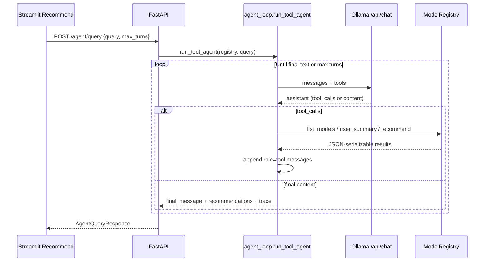

# MovieMind: Multi-Step Tool Agent

This document describes the **tool-calling agent** (`POST /agent/query` and **`POST /agent/query/stream`** for SSE), how it differs from the **quick NLP parser** (`POST /nlp/query`), the technical concepts involved, and how to exercise it from the Streamlit UI.

---

## 1. Why two NLP-flavored paths?

| Path | Endpoint | Behavior |
|------|-----------|----------|
| **Quick parse** | `POST /nlp/query` | One LLM call (or rule parser): returns **intent**, **filters**, **model_hint**. Streamlit then calls **`/recommend`** separately with fixed fields. Good for latency and demos. |
| **Tool agent** | `POST /agent/query` | **Multi-turn** conversation with Ollama **`/api/chat`**: the model may emit **tool calls**; the backend **executes** them against the **same** `ModelRegistry` used by REST. Good for chained reasoning (summary → recommend → filter) and future **onboarding** flows. |

Neither path replaces the other: they trade **simplicity / speed** vs **flexibility / observability** (trace).

---

## 2. Core technical concepts

### 2.1 ReAct + tool calling (what we run)

**ReAct** (Reasoning + Acting) means alternating:

1. **Thought** — short reasoning about what to do next (informed by the user + prior observations).
2. **Action** — here, **only** through **tool calls** to our backend (not arbitrary code).
3. **Observation** — the JSON **tool result** we append to the chat.

We implement this with Ollama’s native **`tool_calls`** on **`/api/chat`**, plus a **system prompt** that asks the model to start each turn’s **`content`** with an explicit **Thought** before emitting tools. That makes reasoning **visible** in the trace and final transcript.

**Important:** The agent’s **capabilities are bounded by the tools we expose** (`list_available_models`, `get_user_summary`, `get_recommendations`). More “intelligence” in the prompt helps **use those tools better**; it does **not** grant new data sources. Adding onboarding or web search would mean **new tools** + usually new prompts—not just longer prose.

### 2.2 Tool schema (function calling)

A **tool** is a named operation with a **JSON Schema** for arguments (OpenAI-style `type: function`). The LLM does not execute code; it proposes **which tool** to run and **with what arguments**. Your server:

1. Sends **system + user messages** and a **tools** array to Ollama **`POST /api/chat`**.
2. Reads the assistant **message**; if it contains **`tool_calls`**, runs each tool in Python.
3. Appends **`role: tool`** messages with **stringified JSON results** (Observations).
4. Repeats until the model responds with **no further tool calls** (final Thought + answer) or **max turns** is hit.

### 2.3 Why Ollama `/api/chat` (not `/api/generate`)?

The quick parser uses **`/api/generate`** with `format: json` for a **single** structured blob. Tool calling requires **multi-message** state and **`tools`** metadata—Ollama exposes that on **`/api/chat`**. You need a **model that supports tools** (e.g. **Llama 3.1** family in Ollama).

### 2.4 Trust boundary

Tools call **`ModelRegistry`** methods directly (same process as FastAPI). The LLM **never** receives raw training CSVs; it only sees **tool outputs** you serialize (JSON strings). That keeps **ground truth** for ratings and rankings on your side.

### 2.5 Genre filtering in the agent (OR + aliases + over-fetch)

Logic lives in **`src/api/genre_helpers.py`** and is applied inside **`get_recommendations`** in **`src/api/agent_loop.py`**.

- **MovieLens** stores genres as a pipe string, e.g. `Animation|Children's|Comedy`. Canonical tokens are the lowercase set **`SUPPORTED_GENRES`** in **`src/api/nlp.py`**. There is **no** genre literally named **`fiction`**.
- **`fiction`** (user language) is mapped to **all narrative genres** = every supported genre **except** **`documentary`** (union used when matching rows).
- **`documentary`** maps to the **`documentary`** token only.
- **OR semantics**: pass **`genre_any`: [`"documentary"`, `"fiction"`]** or **`genre_filter`: `"documentary,fiction"`** / **`"documentary or fiction"`**. A row **matches if any** expanded token appears in its genre tags (intersection non-empty).
- **Over-fetch**: when any genre filter is active, the registry scores **`fetch_n`** candidates (up to 300, at least ~25× requested `top_n`), **then** filters and **truncates** to `top_n`. Without this, filtering after only `top_n` scored movies often leaves wrong genres.
- Tool JSON now includes **`genre_expanded_tokens`**, **`genre_unknown_phrases`**, **`fetch_n`**, and counts so you can see whether the model passed filters and whether aliases applied.

If results **ignore** genres, check the **Agent trace**: the model often omits **`genre_any`/`genre_filter`** on the first try—the **system prompt** now insists on passing them when the user mentions genres.

### 2.6 Identical predicted ratings in the table

If many rows show the **same** rating to four decimals, possible causes: model behaviour over a similar candidate pool, diversity α = 0 with tied rankings, or rounding. Compare **`predicted_rating_raw`** in API payloads when debugging—not always an agent bug.

---

## 3. Architecture (high level)

---

## 4. Tools defined in code

Source: **`src/api/agent_loop.py`** (`OLLAMA_TOOLS`).

| Tool | Maps to | Purpose |
|------|---------|---------|
| `list_available_models` | `registry.list_models()` | Expose **`model_id`**, **`available`**, **`family`** so the model picks a loadable checkpoint. |
| `get_user_summary` | `registry.user_summary(user_id)` | Training-era stats + top genres—useful for **taste** questions and **onboarding** later. |
| `get_recommendations` | `registry.recommend(model_id, user_id, top_n, diversity_alpha)` + optional **genre** filter | Same scoring as **`POST /recommend`**, including **`diversity_alpha`** (0–1, optional on tool args). Genre filter is post-score; diversity reshapes the ranked list like the Manual slider. |

Adding a future **onboarding** tool (e.g. “record preferred genres”) means: implement a registry or session method → add a function entry to **`OLLAMA_TOOLS`** → handle it in **`_execute_tool`**.

---

## 5. API contract

### `POST /agent/query`

**Request** (`AgentQueryRequest`):

- **`query`** (string, min length 3): user instruction in natural language.
- **`max_turns`** (int, default 8, range 1–24): cap on **LLM round-trips** (each round may include multiple tool calls).

**Response** (`AgentQueryResponse`):

- **`final_message`**: model’s closing natural-language reply.
- **`recommendations`**: last list returned by **`get_recommendations`** (may be `null` if the model never called it).
- **`trace`**: opaque list of per-turn assistant payloads and tool previews (for debugging).
- **`turns_used`**: how many **outer** iterations ran.
- **`model`**: Ollama model name used.
- **`error`**: optional (e.g. `max_turns_exceeded`).

**Errors**: **`503`** if Ollama is unreachable or **`/api/chat`** fails (`LocalLLMUnavailableError`).

### `POST /agent/query/stream` (SSE)

Same **JSON body** as **`POST /agent/query`** (`AgentQueryRequest`). Response is **`text/event-stream`**: one **SSE** message per line, each payload JSON with an **`event`** field.

| `event` | When emitted | Payload highlights |
|---------|----------------|---------------------|
| `assistant` | After each **complete** Ollama **`/api/chat`** response that includes an assistant **message** | `turn`, `assistant_message` (same shape Ollama returns: `content`, `tool_calls`, …) |
| `tool` | After each tool finishes in Python | `turn`, `tool`, `tool_output_preview` (truncated JSON string) |
| `done` | Run finished successfully or hit **max turns** | Same fields as **`AgentQueryResponse`** (`final_message`, `recommendations`, `trace`, `turns_used`, `model`, `error`) |
| `error` | Ollama/registry failure before a normal **done** | `detail` (human-readable; typically **`503`-style** copy) |

Clients read lines starting with **`data: `**, strip the prefix, **`json.loads`** the rest.

#### How we got SSE without changing Ollama

**Ollama does not ship a first-class “agent trace SSE” endpoint.** It exposes:

- **`POST /api/chat`** with **`tools`** — each request returns **one** assistant **message** (optionally with **`tool_calls`**) when **`stream` is false**, which is what we use so we can parse tool calls reliably.
- **`stream: true`** on **`/api/chat`** — token streaming for the assistant **text** only; tool calling + streaming is a different integration surface.

Our streaming story is **FastAPI + Starlette**, not an Ollama feature:

1. The agent loop lives in **`iter_tool_agent_events`** (`src/api/agent_loop.py`): each **outer iteration** is still **`requests.post(.../api/chat, stream=False)`** to Ollama, then synchronous Python tool execution.
2. After each assistant message and after each tool result, we **`yield`** a small JSON dict.
3. **`agent_query_stream`** in **`app.py`** wraps that iterator in **`StreamingResponse(..., media_type="text/event-stream")`**, encoding each event as **`data: …\n\n`**. That is **standard SSE**, supported by browsers and HTTP clients with **`stream=True`**.

So you get **incremental UI updates between Ollama round-trips** “for free” from the web stack. You **do not** get token-by-token thoughts inside a single model generation unless we later wire **Ollama’s** **`stream: true`** and map deltas to our event schema (not implemented).

**Practical limits:** Some proxies buffer **`text/event-stream`**; if the UI stalls until the end, disable **Stream agent steps (SSE)** in Streamlit and use **`POST /agent/query`** (single JSON). **`X-Accel-Buffering: no`** is set for nginx-style upstreams.

**Troubleshooting:** **`404`** on **`POST /agent/query/stream`** means the API process does not have this route loaded yet — **restart Uvicorn** (or run with **`--reload`** during development). **`GET /openapi.json`** should list **`/agent/query/stream`** once the new code is active.

---

## 6. Environment variables

| Variable | Role |
|----------|------|
| `MOVIEMIND_OLLAMA_URL` | Ollama base URL (default `http://127.0.0.1:11434`). |
| `MOVIEMIND_OLLAMA_MODEL` | Model tag (default `llama3.1:8b`). |
| `MOVIEMIND_AGENT_TIMEOUT_SEC` | HTTP timeout for **each** `/api/chat` request; falls back to `MOVIEMIND_OLLAMA_TIMEOUT_SEC` then `120`. Agent runs need **large** timeouts (minutes) for slow local GPUs. |
| `MOVIEMIND_OLLAMA_READ_RETRIES` | **Agent only:** extra **full** POST retries when Ollama hits **`ReadTimeout`** on `/api/chat` (default **`2`** → up to **3** attempts per turn). Capped at **5** extras. Does **not** change the model prompt — transport-layer only in **`_call_ollama_chat`**. Set **`0`** to disable. |
| `MOVIEMIND_AGENT_PSEUDO_TOOL_RETRIES` | **Agent only:** if the model prints JSON-shaped “tool calls” in **`content`** but omits native **`tool_calls`**, the server appends a corrective user message and retries that turn (default **`2`** nudges, capped **5**). Set **`0`** to disable. |

---

## 7. Using the UI

1. Start **FastAPI** and **Streamlit** (same as the rest of MovieMind).
2. Open **Recommend** → **Agent (NLP)**.
3. Enable **Multi-step tool agent (Ollama)**.
4. Optionally adjust **Agent max turns** (4–16).
5. Leave **Stream agent steps (SSE)** on (default) to refresh **Thinking** after each tool round via **`POST /agent/query/stream`**; turn off to use one-shot **`POST /agent/query`** if something buffers SSE.
6. Enter a **Natural-language request** (be explicit about **user id**, **model**, **genre** if you want predictable tool args).
7. Click **Run tool agent**.
8. Read **Thinking** (live when SSE is on), then **Agent reply**, the **recommendations** table (if any), and **Raw agent trace (JSON)** if you need the full payload.

**Note:** The **NLP Runtime** dropdown (**Local LLM** vs **API LLM**) applies only to the **quick Parse Query** path. **`/agent/query`** always uses **local Ollama** for the chat loop (caption shown in the UI).

---

## 8. Suggested prompts to try

- “Call **list_available_models**, then recommend **top 10** for **user 25** with **`gradient_boosting`**.”
- “Get **user summary** for **user 100**, then **5 action** movies using **`get_recommendations`** with **`genre_filter`** `action`.”
- “Which models are **available**? Then recommend **3** items with **`ncf_tuned`** for **user 50**.”

### Multi-turn prompts (typically 3-5 turns)

Use these when you want the agent to demonstrate chained tool calls and reasoning:

- “First list available models, then choose the best available non-baseline model, then get user 25 summary, then recommend top 8 sci-fi or documentary movies with some diversity (alpha 0.25). Explain your model choice.”
- “I don't know which model IDs exist. Check available models, pick one from DL family if available, inspect user 1161 taste, then recommend 10 movies mixing fiction and documentary, and show why each matches.”
- “For user 42, first get user summary to infer taste, then decide whether to use gradient_boosting or ncf_tuned based on availability, then recommend top 12 with genre variety and avoid repeating same genre cluster.”
- “Do this step-by-step: (1) list models, (2) pick the highest-capacity available model, (3) get summary for user 100, (4) recommend top 6 action OR thriller with diversity 0.3, (5) if too few after filter, rerun with higher top_n and then return best 6.”

---

## 9. Limitations and extensions

- **Max turns**: If the model keeps calling tools without a final answer, the loop stops and **`error`** may be set.
- **API LLM**: The tool agent does not use your cloud LLM slot; wiring that would be a separate adapter.
- **MCP**: Not required. MCP is for **external** clients (e.g. IDE) calling tools; your agent already lives **inside** FastAPI.
- **Onboarding**: Next step is a new tool that **writes** structured preferences (session/DB) and optionally a prompt branch that uses **`get_user_summary`** + cold-start heuristics.

---

## 10. Source files

| File | Responsibility |
|------|----------------|
| `src/api/agent_loop.py` | Tool definitions, `_execute_tool`, `iter_tool_agent_events`, `run_tool_agent`. |
| `src/api/app.py` | `POST /agent/query`, `POST /agent/query/stream` (SSE). |
| `src/api/schemas.py` | `AgentQueryRequest`, `AgentQueryResponse`. |
| `app/streamlit_app.py` | Checkbox, **Run tool agent** button, trace expander. |
| `src/api/model_registry.py` | Underlying **recommend**, **user_summary**, **list_models**. |

---

## 11. Related docs

- **`WEBAPP_AGENT_WIKI.md`** — Streamlit + REST overview.
- **`LOCAL_LLM_WIKI.md`** — Ollama setup for **`/nlp/query`** (same daemon used here).
