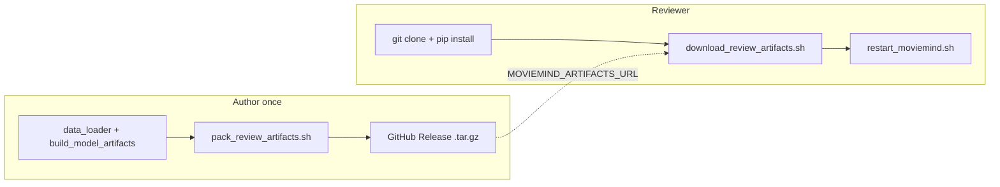

# Artifacts, download, and runtime scripts

End-to-end picture for **what is in git**, **what ships in a release tarball**, and **what each helper script does**.

Related: [`../REVIEWER_SETUP.md`](../REVIEWER_SETUP.md) (checklists), [`../REPLICATION.md`](../REPLICATION.md) (train locally), [`README.md`](README.md) (doc index).

---

## What lives where

| Location | In git? | Needed to run recommendations? |
|----------|---------|--------------------------------|
| `src/`, `app/`, `scripts/`, `notebooks/`, `evidence/` | Yes | Source + proof; evidence is optional for runtime |
| `data/ml-1m/` | No (gitignored) | Yes — raw MovieLens (or inside release tarball) |
| `data/processed/` | No | Yes — feature CSVs for API/UI |
| `models/` | No | Yes for ML/DL models (baseline can use features only) |
| Ollama models | No | Only for **local-llm** parse and **tool agent** |

Typical disk after a full local build: **~160 MB** under `data/` + `models/` (your tree may vary if DL checkpoints are present).

---

## End-to-end flow



| Step | Who | What |
|------|-----|------|
| Train / build | Author (or reviewer reproducing) | `REPLICATION.md` / `build_model_artifacts.py` |
| Create archive | Author | `scripts/pack_review_artifacts.sh` |
| Publish URL | Author | GitHub Releases (or any HTTPS host) |
| Fetch binaries | Reviewer | `scripts/download_review_artifacts.sh` |
| Start servers | Reviewer (or you) | `scripts/restart_moviemind.sh` |

---

## `pack_review_artifacts.sh`

**Who:** project author, after a successful build.  
**When:** once per release (or when artifacts change).  
**Run from:** `moviemind/`

```bash
bash scripts/pack_review_artifacts.sh
# optional: bash scripts/pack_review_artifacts.sh my-bundle.tar.gz
```

### What it contains

The script runs:

```bash
tar -czf moviemind-artifacts.tar.gz data models
```

So the archive is **both gitignored trees**, with paths preserved at the repo root:

| Folder | Contents |
|--------|----------|
| **`data/`** | `data/ml-1m/*.dat` (raw MovieLens) and `data/processed/*.csv` (engineered features) |
| **`models/`** | Whatever you built locally: e.g. `*.pkl`, `*.pt`, `best_dl_params.txt`, training logs, plots |

### Preconditions

Exits with an error unless these exist:

- `data/processed/train_features.csv`
- `models/gradient_boosting.pkl`

(Build with `REVIEWER_SETUP.md` §4.3 Path A minimum, or full `REPLICATION.md` Tier 2.)

### What it does **not** include

- Python source, `requirements.txt`, venv
- `notebooks/`, committed `evidence/`
- Ollama model weights (reviewers install Ollama separately if needed)

### After packing

Upload `moviemind-artifacts.tar.gz` to a **GitHub Release** and note the direct download URL for `MOVIEMIND_ARTIFACTS_URL`.

---

## `download_review_artifacts.sh`

**Who:** reviewers (or you on a fresh clone).  
**When:** after `pip install -r requirements.txt`, **instead of** local training.  
**Run from:** `moviemind/`

```bash
export MOVIEMIND_ARTIFACTS_URL="https://github.com/mmaashraf/moviemind/releases/download/v1.0-artifacts/moviemind-artifacts.tar.gz"
bash scripts/download_review_artifacts.sh
# Release page: https://github.com/mmaashraf/moviemind/releases/tag/v1.0-artifacts
```

### Behavior

1. If `data/processed/train_features.csv` **and** `models/gradient_boosting.pkl` already exist → prints *Artifacts already present* and **exits 0** (no download).
2. Otherwise requires `MOVIEMIND_ARTIFACTS_URL` (or URL as first argument).
3. Downloads the `.tar.gz` with `curl` to a temp file.
4. Extracts with `tar -xzf … -C moviemind/` so top-level paths are `./data/` and `./models/`.
5. Verifies the two key files above; fails if layout is wrong.

### What it does **not** do

- Install Python packages
- Start API or Streamlit
- Install or pull Ollama models

---

## `restart_moviemind.sh`

**Local only:** starts HTTP services on **127.0.0.1** — no TLS, auth, or rate limits ([`SECURITY.md`](SECURITY.md)).

**Who:** anyone with artifacts on disk.  
**When:** whenever you want a clean API + UI on default ports.  
**Run from:** `moviemind/` (or any path; script `cd`s to repo root)

```bash
bash scripts/restart_moviemind.sh
```

### Default behavior

1. **Stop** listeners on **8000** (FastAPI) and **8502** (Streamlit): pid files under `evidence/runtime/`, then `lsof` kill.
2. **Start** in background (if `.venv` exists, activates it):
   - `uvicorn src.api.app:app` → http://127.0.0.1:8000 (`/docs`, `/health`, …)
   - `streamlit run app/streamlit_app.py` → http://127.0.0.1:8502
3. Logs: `evidence/runtime/api.log`, `evidence/runtime/ui.log`
4. Waits until API `/health` and UI respond.

### Flags

| Flag | Effect |
|------|--------|
| `--stop-only` | Kill API/UI only |
| `--start-only` | Start without stopping first |
| `--with-ollama` | Also run `scripts/setup_local_ollama.sh` |
| `--foreground` | API background, Streamlit foreground (Ctrl+C stops UI) |

Env overrides: `MOVIEMIND_API_PORT`, `MOVIEMIND_UI_PORT`, `MOVIEMIND_API_HOST`, `MOVIEMIND_UVICORN_RELOAD`.

### What it does **not** do

- Download MovieLens or trained weights
- Train models

If `data/` or `models/` are missing, servers may start but **recommendations will fail** until artifacts exist (download or local build).

---

## Reviewer quick path (~2 minutes + download time)

```bash
git clone https://github.com/mmaashraf/moviemind.git && cd moviemind
python3 -m venv .venv && source .venv/bin/activate
pip install -r requirements.txt
export MOVIEMIND_ARTIFACTS_URL="https://github.com/mmaashraf/moviemind/releases/download/v1.0-artifacts/moviemind-artifacts.tar.gz"
bash scripts/download_review_artifacts.sh
bash scripts/restart_moviemind.sh
```

Open http://127.0.0.1:8502 (API http://127.0.0.1:8000). For tool agent / local LLM, start Ollama separately or use `--with-ollama`.

Without a release URL: build locally per [`../REVIEWER_SETUP.md`](../REVIEWER_SETUP.md) §4.2–4.3 (~15–45 min minimum).

---

## Author release checklist

1. Complete build (minimum Path A or full Tier 2 in `REPLICATION.md`).
2. `bash scripts/pack_review_artifacts.sh`
3. Create GitHub Release; upload `moviemind-artifacts.tar.gz`.
4. Set real URL in `REVIEWER_SETUP.md` §2.4 and in course/submission instructions.
5. Smoke-test on a clean clone: download → `restart_moviemind.sh` → Manual recommend (user 1, `gradient_boosting`).

---

## Notebooks vs training vs app

| Action | Touches `data/processed` or `models/`? | Breaks running app? |
|--------|----------------------------------------|---------------------|
| Run `notebooks/01_eda.ipynb`, `02_long_tail_and_cold_start.ipynb` | No (read `data/ml-1m` only) | No |
| Run `download_review_artifacts.sh` | Yes (restores folders) | No — restart API if already running |
| Run `build_model_artifacts.py` / training scripts | Yes (overwrites) | May need API restart; sklearn version must match |
| Run `restart_moviemind.sh` | No | Restarts processes only |
