# MovieMind AI Lifecycle Flow Diagram

This diagram is generated from `AI_LIFECYCLE_PLAN.md`.

```mermaid
flowchart LR
    A[Phase 1: Initialization & Data Acquisition<br/>Branch: phase-1-setup<br/>Repo/env setup + MovieLens ingestion] --> B
    B[Phase 2: Exploratory Data Analysis<br/>Branch: phase-2-eda<br/>Distribution, sparsity, long-tail, cold-start evidence] --> C
    C[Phase 3: Data Prep & Feature Engineering<br/>Branch: phase-3-features<br/>User/movie features + strict time-based split] --> D
    D[Phase 4: ML Modeling<br/>Branch: phase-4-ml-modeling<br/>Baseline + Linear + RF/GB + evaluation metrics] --> E
    E[Phase 5: DL Modeling<br/>Branch: phase-5-dl-modeling<br/>NCF-style PyTorch embeddings model] --> E5
    E5[Phase 5b: DL Hyperparameter Tuning<br/>Branch: phase-5-dl-modeling<br/>Optuna 50-trial search + best params artifact] --> F
    F[Phase 6: Post-Modeling Analysis & XAI<br/>Branch: phase-6-analysis<br/>Feature importance + embedding PCA/t-SNE artifacts] --> G
    G[Phase 7: Backend API Development<br/>Branch: phase-7-api<br/>FastAPI: health/models/info/predict/recommend/nlp] --> H
    H[Phase 8: Web UI & Agent Layer<br/>Branch: phase-8-ui<br/>Streamlit tabs + model inspector + runtime NLP modes] --> I
    I[Phase 8.x: UX/Explainability Enhancements<br/>Feature branches<br/>Taste map, diversity controls, evidence pages, visualizers]

    D --> V1[Verification Gate A<br/>Model evaluation checks + artifact logging]
    G --> V2[Verification Gate B<br/>API smoke tests + live endpoint evidence]
    H --> V3[Verification Gate C<br/>UI/NLP validation + evidence capture]
    V1 --> V2
    V2 --> V3
```

## PPT Usage

- Export/screenshot this diagram and place it on the **Methodology** slide.
- Keep the phase labels as-is to stay aligned with the lifecycle plan and branch strategy.
